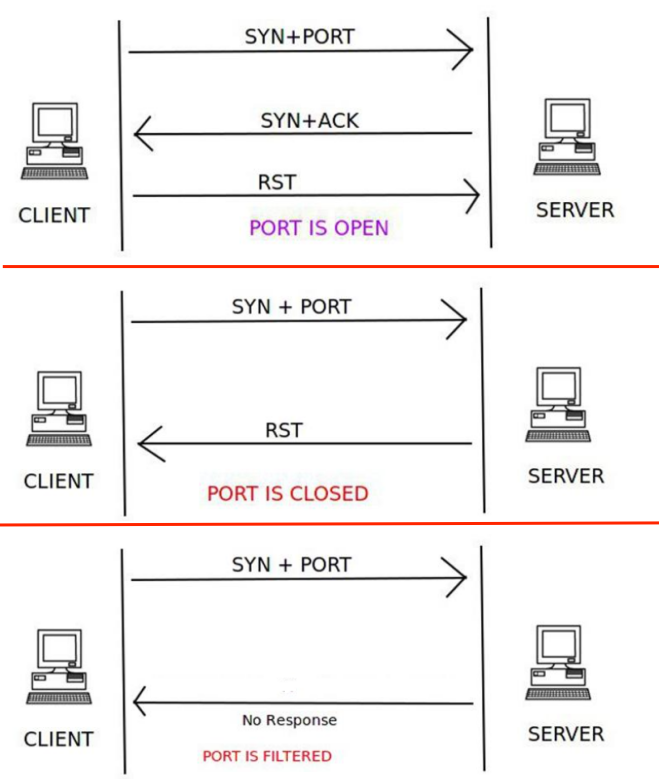
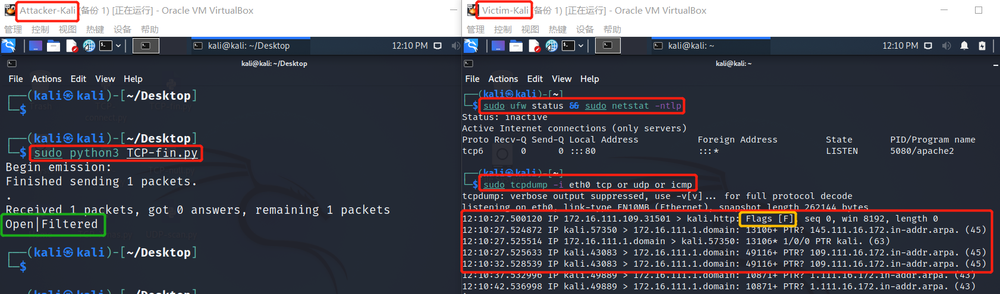
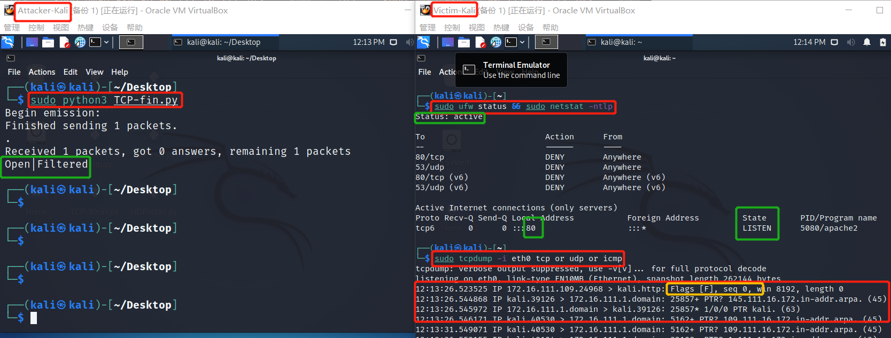
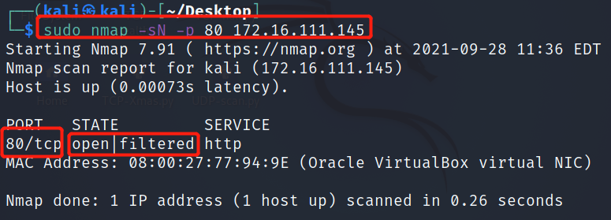

- [CHAP0x05 基于Scapy编写端口扫描器](#chap0x05-基于scapy编写端口扫描器)
  - [实验目的](#实验目的)
  - [实验环境](#实验环境)
  - [实验要求](#实验要求)
  - [实验过程](#实验过程)
    - [实验准备](#实验准备)
    - [端口状态模拟](#端口状态模拟)
    - [TCP connect scan](#tcp-connect-scan)
      - [CLOSED](#closed)
      - [OPEN](#open)
      - [FILTERED](#filtered)
    - [TCP stealth scan](#tcp-stealth-scan)
      - [CLOSED](#closed-1)
      - [OPEN](#open-1)
      - [FILTERED](#filtered-1)
    - [TCP Xmas scan](#tcp-xmas-scan)
      - [CLOSED](#closed-2)
      - [OPEN](#open-2)
      - [FILTERED](#filtered-2)
    - [TCP fin scan](#tcp-fin-scan)
      - [CLOSED](#closed-3)
      - [OPEN](#open-3)
      - [FILTERED](#filtered-3)
    - [TCP null scan](#tcp-null-scan)
      - [CLOSED](#closed-4)
      - [OPEN](#open-4)
      - [FILTERED](#filtered-4)
    - [UDP scan](#udp-scan)
      - [CLOSED](#closed-5)
      - [OPEN](#open-5)
      - [FILTERED](#filtered-5)
  - [问题及解决](#问题及解决)
  - [参考资料](#参考资料)

# CHAP0x05 基于Scapy编写端口扫描器
## 实验目的
- 掌握网络扫描之端口状态探测的基本原理
## 实验环境
- VirtualBox 6.1 虚拟机
- 网关（Gateway）：Debian Buster
- 攻击者主机（Attacker）：Kali Rolling 2109.2
- 受害者主机（Victim）：Kali Rolling 2109.2
- Python 3.9.2
- scapy 2.4.4 

|  主机身份 | 名称 |IP地址 |  mac地址 |
|----       |----|----|----|
|  网关               |  Gateway-Debian |172.16.111.1/24    |08:00:27:53:e0:03   |
|  攻击者主机(扫描)    |  Attacker-Kali  |172.16.111.109/24  | 08:00:27:bc:65:6a   |
|  受害者主机(被扫描)  |  Victim-Kali    |172.16.111.145/24  |08:00:27:77:94:9e  |


## 实验要求
- [x] 完成以下扫描技术的编程实现
    - [x] TCP connect scan / TCP stealth scan
    - [x] TCP Xmas scan / TCP fin scan / TCP null scan
    - [x] UDP scan
- [x] 上述每种扫描技术的实现测试均需要测试端口状态为：`开放`、`关闭` 和 `过滤` 状态时的程序执行结果
- [x] 提供每一次扫描测试的抓包结果并分析与课本中的扫描方法原理是否相符？如果不同，试分析原因；
- [x] 在实验报告中详细说明实验网络环境拓扑、被测试 IP 的端口状态是如何模拟的
- [x] （可选）复刻 nmap 的上述扫描技术实现的命令行参数开关
## 实验过程
### 实验准备

```bash
# 用到的代码

# 查看防火墙和端口状态
sudo ufw status && sudo netstat -ntlp  #TCP
sudo ufw status && sudo netstat -nulp  #UDP

# nmap指令
sudo nmap -sT -p 80 172.16.111.145
sudo nmap -sS -p 80 172.16.111.145
sudo nmap -sX -p 80 172.16.111.145
sudo nmap -sF -p 80 172.16.111.145
sudo nmap -sN -p 80 172.16.111.145
sudo nmap -sU -p 53 172.16.111.145
```

### 端口状态模拟
- **关闭状态**：对应端口没有开启监听, 防火墙没有开启。
`ufw disable`
- **开启状态**：对应端口开启监听: apache2基于TCP, 在80端口提供服务; DNS服务基于UDP,在53端口提供服务。防火墙处于关闭状态。
`systemctl start apache2 # port 80`
`systemctl start dnsmasq # port 53`
- **过滤状态**：对应端口开启监听, 防火墙开启。
`ufw enable && ufw deny 80/tcp`
`ufw enable && ufw deny 53/udp`
### TCP connect scan
- 原理

    
- 扫描代码[TCP-connect.py](./code/TCP-connect.py)
    ```python
    import logging
    logging.getLogger("scapy.runtime").setLevel(logging.ERROR)
    from scapy.all import *
    dst_ip = "172.16.111.145"   # Victim-Kali
    src_port = RandShort()
    dst_port = 80

    # 发送SYN+Port(n)
    tcp_connect_scan_resp = sr1(IP(dst=dst_ip)/TCP(sport=src_port,dport=dst_port,flags="S"),timeout=10)

    # 无响应/其他拒绝反馈报文
    if tcp_connect_scan_resp is None:
        print("Filtered")

    elif(tcp_connect_scan_resp.haslayer(TCP)):

        # 回复SYN
        if(tcp_connect_scan_resp.getlayer(TCP).flags == 0x12):  #Flags: 0x012 (SYN, ACK)
            send_rst = sr(IP(dst=dst_ip)/TCP(sport=src_port,dport=dst_port,flags="AR"),timeout=10)
            print("Open")

        # 回复RST
        elif (tcp_connect_scan_resp.getlayer(TCP).flags == 0x14):   #Flags: 0x014 (RST, ACK)
            print ("Closed")
    ```
#### CLOSED
- `sudo python TCP-connect.py`执行代码
- 输出及被扫描端抓包结果

- `nmap`复刻
`sudo nmap -sT -p 80 172.16.111.145`

#### OPEN
- `sudo python TCP-connect.py`执行代码
- 输出及被扫描端抓包结果

- `nmap`复刻
`sudo nmap -sT -p 80 172.16.111.145`

#### FILTERED
- `sudo python TCP-connect.py`执行代码
- 输出及被扫描端抓包结果

- `nmap`复刻
`sudo nmap -sT -p 80 172.16.111.145`


### TCP stealth scan
- 原理

    
- 扫描代码[TCP-stealth.py](./code/TCP-stealth.py)
    ```python
    import logging
    logging.getLogger("scapy.runtime").setLevel(logging.ERROR)
    from scapy.all import *
    dst_ip = "172.16.111.145"   # Victim-Kali
    src_port = RandShort()
    dst_port = 80

    # 发送SYN+Port(n)
    tcp_stealth_scan_resp = sr1(IP(dst=dst_ip)/TCP(sport=src_port,dport=dst_port,flags="S"),timeout=10)

    # 无响应/其他拒绝反馈报文
    if tcp_stealth_scan_resp is None:
        print("Filtered")

    elif(tcp_stealth_scan_resp.haslayer(TCP)):

        # 回复SYN
        if(tcp_stealth_scan_resp.getlayer(TCP).flags == 0x12):  #Flags: 0x012 (SYN, ACK)
            send_rst = sr(IP(dst=dst_ip)/TCP(sport=src_port,dport=dst_port,flags="R"),timeout=10)
            print("Open")

        # 回复RST
        elif (tcp_stealth_scan_resp.getlayer(TCP).flags == 0x14):   #Flags: 0x014 (RST, ACK)
            print ("Closed")

    # ICMP Error(Type 3,Code 1/2/3/9/10/13)
    elif(tcp_stealth_scan_resp.haslayer(ICMP)):
        if(int(tcp_stealth_scan_resp.getlayer(ICMP).type)==3 and int(tcp_stealth_scan_resp.getlayer(ICMP).code) in [1,2,3,9,10,13]):
            print("Filtered")
    ```
#### CLOSED
- `sudo python TCP-stealth.py`执行代码
- 输出及被扫描端抓包结果

- `nmap`复刻
`sudo nmap -sS -p 80 172.16.111.145`

#### OPEN
- `sudo python TCP-stealth.py`执行代码
- 输出及被扫描端抓包结果

- `nmap`复刻
`sudo nmap -sS -p 80 172.16.111.145`

#### FILTERED
- `sudo python TCP-stealth.py`执行代码
- 输出及被扫描端抓包结果

- `nmap`复刻
`sudo nmap -sS -p 80 172.16.111.145`

### TCP Xmas scan 
- 原理
    
    
- 扫描代码[TCP-Xmas.py](./code/TCP-Xmas.py)
    ```python
    import logging
    logging.getLogger("scapy.runtime").setLevel(logging.ERROR)
    from scapy.all import *
    dst_ip = "172.16.111.145"   # Victim-Kali
    src_port = RandShort()
    dst_port = 80

    # 发送TCP FIN(1),PUSH(1),URG(1)+Port(n)
    tcp_Xmas_scan_resp = sr1(IP(dst=dst_ip)/TCP(sport=src_port,dport=dst_port,flags="FPU"),timeout=10)

    # 无响应/其他拒绝反馈报文
    if tcp_Xmas_scan_resp is None:
        print("Open|Filtered")

    # 回复RST
    elif(tcp_Xmas_scan_resp.haslayer(TCP)):
        if (tcp_Xmas_scan_resp.getlayer(TCP).flags == 0x14):   #Flags: 0x014 (RST, ACK)
            print ("Closed")

    # ICMP Error(Type 3,Code 1/2/3/9/10/13)
    elif(tcp_Xmas_scan_resp.haslayer(ICMP)):
        if(int(tcp_Xmas_scan_resp.getlayer(ICMP).type)==3 and int(tcp_xmas_scan_resp.getlayer(ICMP).code) in [1,2,3,9,10,13]):
            print("Filtered")
    ```
#### CLOSED
- `sudo python TCP-Xmas.py`执行代码
- 输出及被扫描端抓包结果

- `nmap`复刻
`sudo nmap -sX -p 80 172.16.111.145`

#### OPEN
- `sudo python TCP-Xmas.py`执行代码
- 输出及被扫描端抓包结果

- `nmap`复刻
`sudo nmap -sX -p 80 172.16.111.145`

#### FILTERED
- `sudo python TCP-Xmas.py`执行代码
- 输出及被扫描端抓包结果

- `nmap`复刻
`sudo nmap -sX -p 80 172.16.111.145`

### TCP fin scan 
- 原理
    
    
- 扫描代码[TCP-fin.py](./code/TCP-fin.py)
    ```python
    import logging
    logging.getLogger("scapy.runtime").setLevel(logging.ERROR)
    from scapy.all import *
    dst_ip = "172.16.111.1"   # Gateway-Debian
    src_port = RandShort()
    dst_port = 80

    # 发送FIN+Port(n)
    tcp_fin_scan_resp = sr1(IP(dst=dst_ip)/TCP(sport=src_port,dport=dst_port,flags="F"),timeout=10)

    # 无响应/其他拒绝反馈报文
    if tcp_fin_scan_resp is None:
        print("Open|Filtered")

    # 回复RST
    elif(tcp_fin_scan_resp.haslayer(TCP)):
        if (tcp_fin_scan_resp.getlayer(TCP).flags == 0x14):   #Flags: 0x014 (RST, ACK)
            print ("Closed")

    # ICMP Error(Type 3,Code 1/2/3/9/10/13)
    elif(tcp_fin_scan_resp.haslayer(ICMP)):
        if(int(tcp_fin_scan_resp.getlayer(ICMP).type)==3 and int(tcp_fin_scan_resp.getlayer(ICMP).code) in [1,2,3,9,10,13]):
            print("Filtered")
    ```
#### CLOSED
- `sudo python TCP-fin.py`执行代码
- 输出及被扫描端抓包结果

- `nmap`复刻
`sudo nmap -sF -p 80 172.16.111.145`

#### OPEN
- `sudo python TCP-fin.py`执行代码
- 输出及被扫描端抓包结果

- `nmap`复刻
`sudo nmap -sF -p 80 172.16.111.145`

#### FILTERED
- `sudo python TCP-fin.py`执行代码
- 输出及被扫描端抓包结果

- `nmap`复刻
`sudo nmap -sF -p 80 172.16.111.145`


### TCP null scan
- 原理
    
    
- 扫描代码[TCP-null.py](./code/TCP-null.py)
    ```python
    import logging
    logging.getLogger("scapy.runtime").setLevel(logging.ERROR)
    from scapy.all import *
    dst_ip = "172.16.111.145"   # Victim-Kali
    src_port = RandShort() 
    dst_port = 80

    # 发送TCP FIN(0),PUSH(0),URG(0)+Port(n)
    tcp_null_scan_resp = sr1(IP(dst=dst_ip)/TCP(sport=src_port,dport=dst_port,flags=""),timeout=10)

    # 无响应/其他拒绝反馈报文
    if tcp_null_scan_resp is None:
        print("Open|Filtered")

    # 回复RST
    elif(tcp_null_scan_resp.haslayer(TCP)):
        if (tcp_null_scan_resp.getlayer(TCP).flags == 0x14):   #Flags: 0x014 (RST, ACK)
            print ("Closed")

    # ICMP Error(Type 3,Code 1/2/3/9/10/13)
    elif(tcp_null_scan_resp.haslayer(ICMP)):
        if(int(tcp_null_scan_resp.getlayer(ICMP).type)==3 and int(tcp_null_scan_resp.getlayer(ICMP).code) in [1,2,3,9,10,13]):
            print("Filtered")
    ```
#### CLOSED
- `sudo python TCP-null.py`执行代码
- 输出及被扫描端抓包结果

- `nmap`复刻
`sudo nmap -sN -p 80 172.16.111.145`

#### OPEN
- `sudo python TCP-null.py`执行代码
- 输出及被扫描端抓包结果

- `nmap`复刻
`sudo nmap -sN -p 80 172.16.111.145`

#### FILTERED
- `sudo python TCP-null.py`执行代码
- 输出及被扫描端抓包结果

- `nmap`复刻
`sudo nmap -sN -p 80 172.16.111.145`

### UDP scan
- 原理
    
    
- 扫描代码[UDP-scan.py](./code/UDP-scan.py)
    ```python
    import logging
    logging.getLogger("scapy.runtime").setLevel(logging.ERROR)
    from scapy.all import *
    dst_ip = "172.16.111.145"   # Victim-Kali
    src_port = RandShort()
    dst_port = 53

    # 发送UDP+Port(n)
    UDP_scan_resp = sr1(IP(dst=dst_ip)/UDP(sport=src_port,dport=dst_port),timeout=10)

    # 无响应/其他拒绝反馈报文
    if UDP_scan_resp is None:
        print("Open|Filtered")

    # UDP+port(n) 响应数据
    elif(UDP_scan_resp.haslayer(UDP)):
        print("Open")

    elif(UDP_scan_resp.haslayer(ICMP)):

        # ICMP Error(Type 3,Code 3)
        if(int(UDP_scan_resp.getlayer(ICMP).type) == 3 and int(UDP_scan_resp.getlayer(ICMP).code) == 3):
            print("Closed")
        
        # ICMP Error(Type 3,Code 1/2/9/10/13)
        elif(int(UDP_scan_resp.getlayer(ICMP).type) == 3 and int(UDP_scan_resp.getlayer(ICMP).code) in [1, 2, 9, 10, 13]):
            print("Filtered")
    ```
#### CLOSED
- `sudo python UDP-scan.py`执行代码
- 输出及被扫描端抓包结果

- `nmap`复刻
`sudo nmap -sU -p 53 172.16.111.145`

#### OPEN
- `sudo python UDP-scan.py`执行代码
- 输出及被扫描端抓包结果

- `nmap`复刻
`sudo nmap -sU -p 53 172.16.111.145`

#### FILTERED
- `sudo python UDP-scan.py`执行代码
- 输出及被扫描端抓包结果

- `nmap`复刻
`sudo nmap -sU -p 53 172.16.111.145`

## 问题及解决
1. 提供每一次扫描测试的抓包结果并分析与课本中的扫描方法原理是否相符

    答：相符，抓包结果见实验过程

2. 运行代码时`Open`状态没有对应的输出，且代码没有错误

    原因：`TCP`扫描重复使用80端口，`Filtered`状态转至`Open`状态时要更改防火墙和监听状态两处，使用`ufw disable`只改变了一处
    
    解决：执行代码
    `sudo ufw disable`
    `sudo systemctl stop apache2`
    
## 参考资料
[1] [TCP 报文格式及TCP Flags](https://blog.csdn.net/gyunling/article/details/89330307)

[2] [scapy构造数据包总结](https://blog.csdn.net/dwj_daiwenjie/article/details/100983980)

[3] [scapy学习icmp报文](https://blog.csdn.net/cracker_zhou/article/details/54982815)

[4] [port-scanning-using-scapy](https://resources.infosecinstitute.com/topic/port-scanning-using-scapy/)

[5] [nmap命令参数](https://nmap.org/book/man-host-discovery.html)

[6] [18信安前辈的实验报告](https://github.com/CUCCS/2020-ns-public-kate123wong/tree/chap0x05)