[toc]

# CHAP0x01 基于VirtualBox的网络攻防基础环境搭建
## 实验目的
- 掌握 VirtualBox 虚拟机的安装与使用；
- 掌握 VirtualBox 的虚拟网络类型和按需配置；
- 掌握 VirtualBox 的虚拟硬盘多重加载；
## 实验环境
- VirtualBox 6.1 虚拟机
- 攻击者主机（Attacker）：Kali Rolling 2109.2
- 网关（Gateway）：Debian Buster
- 靶机（Victim）：From Sqli to shell / xp-sp3 / Kali
    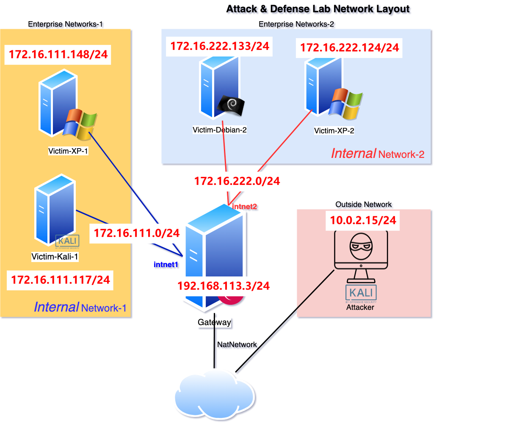
## 实验要求
完成以下网络连通性测试；
- [x] 靶机可以直接访问攻击者主机
- [x] 攻击者主机无法直接访问靶机
- [x] 网关可以直接访问攻击者主机和靶机
- [x] 靶机的所有对外上下行流量必须经过网关
- [x] 所有节点均可以访问互联网
## 实验过程
1. 配置多重加载：以`Windows_XP`为例
    >释放-->选择[多重加载]-->应用
    
    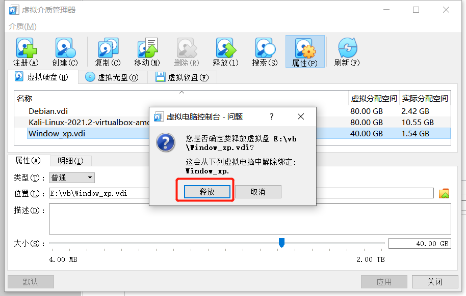
    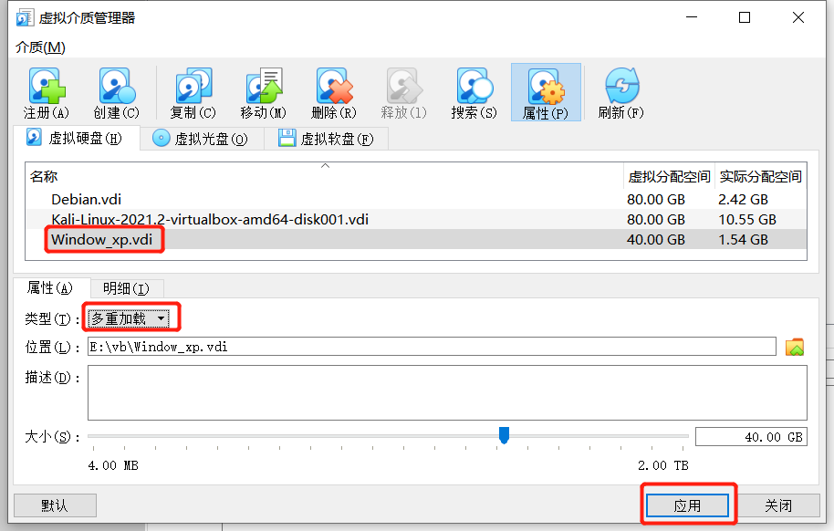
2. 挂载多重加载的硬盘

    
3. 查看虚拟机状态，已配置完成`多重加载`，其余虚拟机操作同上

    
4. 新建需要的虚拟机（按照老师的拓扑图）

    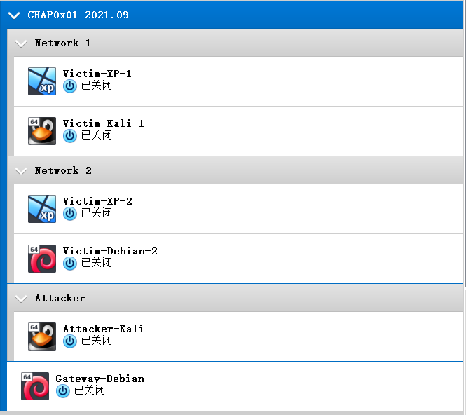
5. 配置`Host-Only`网卡
    >管理-->主机网络管理器-->VirtualBox Host-Only Ethernet Adapter #2

    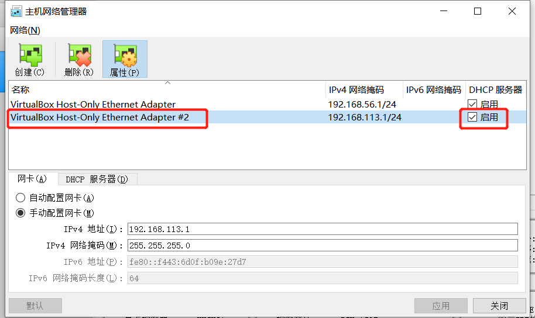
    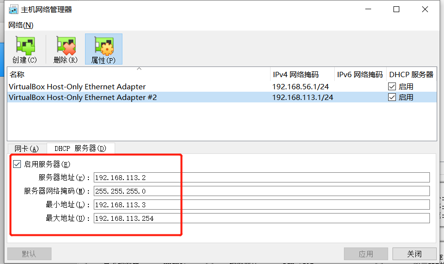
6. 配置各个虚拟机的网卡（过程较多，只展示最后完成的配置）
    - `Gateway-Debian`

    
    - `Attacker`
        - `Attacker-Kali` 

        
    - `Network 1(Victim)`
        - `Victim-XP-1`

        
        - `Victim-Kali-1`

        
    - `Network 2(Victim)`
        - `Victim-XP-2`

        
        - `Victim-Debian-2`

        

7. `ip a或ipconfig`查看虚拟机的`ip`以及网关，获得如下拓扑图（标注`ip`地址）

    
8. 网络连通性测试
    靶机共有四个，分别在两个子网中各选择一个进行连通性测试，`[Victim-XP-1]`简写`v1`，`[Victim-Debian-2]`简写`v2`，`[Attacker-Kali]`简写`a`。

    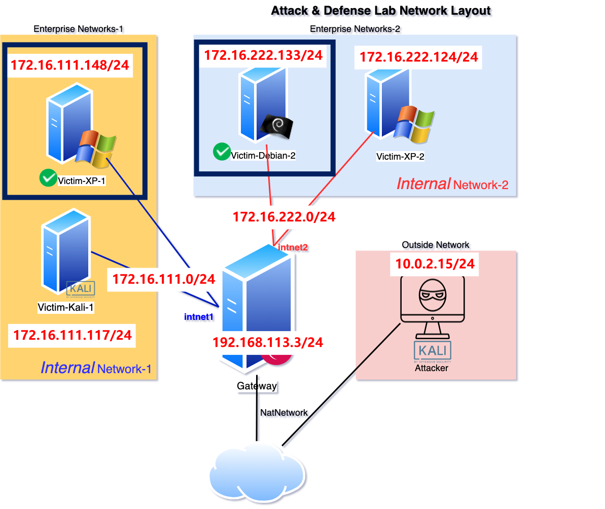
    - [x] 靶机可以直接访问攻击者主机
        ```
        攻击者[Attacker-Kali]:10.0.2.15/24
        靶机1[Victim-XP-1](internal-net-1):172.16.111.148/24
        靶机2[Victim-Debian-2](internal-net-2):172.16.222.133/24
        ```

        - [x] `[Victim-XP-1]`--->`[Attacker-Kali]`

        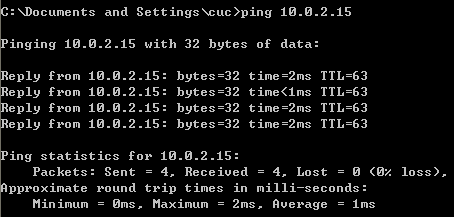

        - [x] `[Victim-Debian-2]`--->`[Attacker-Kali]`

        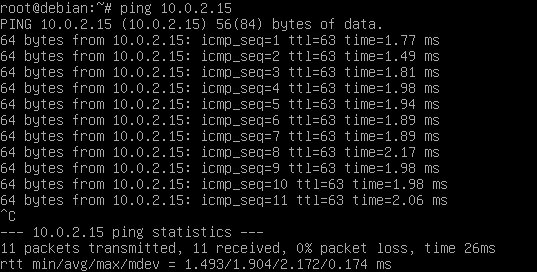
    - [x] 攻击者主机无法直接访问靶机
        ```
        攻击者:10.0.2.15/24
        靶机1(internal-net-1):172.16.111.148/24
        靶机2(internal-net-2):172.16.222.133/24
        ```
        - [x] `[Attacker-Kali]`--->`[Victim-XP-1]`

        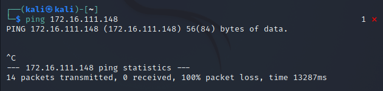
        
        - [x] `[Attacker-Kali]`--->`[Victim-Debian-2]`

        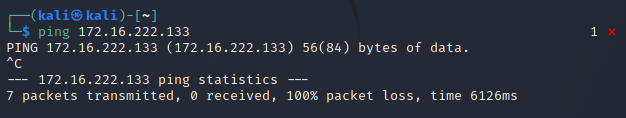
    - [x] 网关可以直接访问攻击者主机和靶机
        ```
        网关:192.168.113.3/24
        攻击者:10.0.2.15/24
        靶机1(internal-net-1):172.16.111.148/24
        靶机2(internal-net-2):172.16.222.133/24
        ```
        - [x] `[Gateway-Debian]`--->`[Attacker-Kali]`

        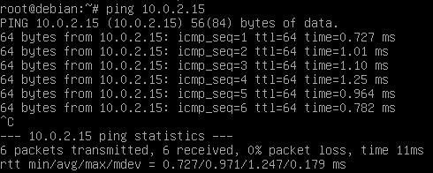

        - [x] `[Gateway-Debian]`--->`[Victim-XP-1]`

        

        - [x] `[Gateway-Debian]`--->`[Victim-Debian-2]`

        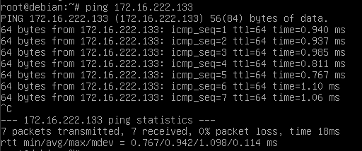
    - [x] 靶机的所有对外上下行流量必须经过网关
        ```
        tcpdump -i enp0s9 -n -w 20210910.pcap
        ```
        捕获的`pcap`文件：

        - [x] `ping www.baidu.com`

        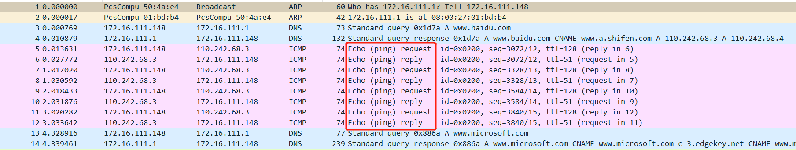

        - [x] 访问`e.cuc.edu.cn`

        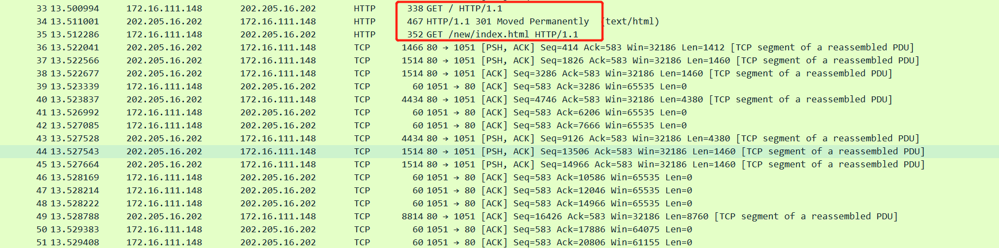

    - [x] 所有节点均可以访问互联网

        - [x] `[Gateway-Debian]`--->`[baidu.com]`

        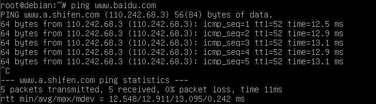

        - [x] `[Attacker-Kali]`--->`[baidu.com]`

        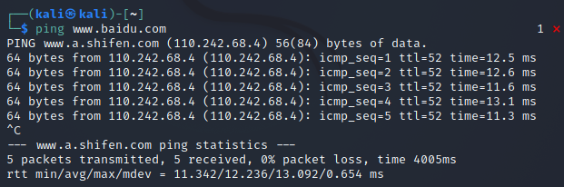

        - [x] `[Victim-XP-1]`--->`[baidu.com]`

        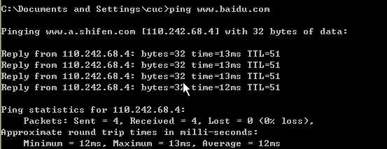

        - [x] `[Victim-Debian-2]`--->`[baidu.com]`

        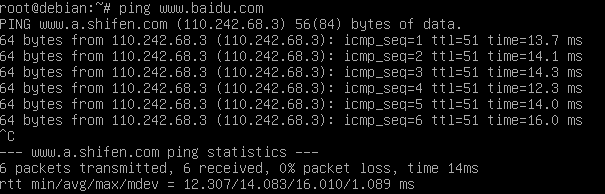
## 问题及解决
1. 多重加载报错
    原因：之前已经安装了虚拟机并挂载，所以`vdi`已经被占用，不能释放（灰色）也不能改为多重加载。
    解决：因为之前的虚拟机没用了，我就都删除了然后重新注册<sup>[1]</sup>，后面参照教程<sup>[2]</sup>配置多重加载。

    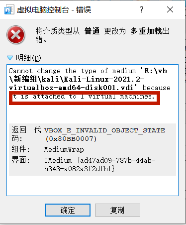
2. `Host-only`网卡不能正常运行
    原因：配置的时候新建了新的网卡，但是选择的是默认网卡，查看网络配置发现只有新注册的网卡`VirtualBox Host-Only Ethernet Adapter #2`。
    解决：把涉及`Host-only`的网卡界面选为新建的网卡`VirtualBox Host-Only Ethernet Adapter #2`。
3. `NAT网络`无效配置
    原因：之前没有用过`NAT网络`，所以没有配置过，没有配置就不可选
    解决：参照教程配置<sup>[5]</sup>
4. `pcap`文件不能下载到本地查看
    原因：`root`用户ssh登陆不上，`tami`用户对文件没有权限。
    解决：通过`ssh`登录`tami`用户然后升级`root`权限
    ```
    # ssh连接虚拟机
    $ssh tami@192.168.113.3

    # 升级root权限
    tami@debian:~$ su

    # 将root里的文件复制到tami
    root@debian:/home/tami# scp root@192.168.113.3:/home/root/workspace/20210910.pcap ./

    # 退出登录
    root@debian://home/tami# exit
    tami@debian:~$ exit

    # 将虚拟机文件复制到桌面
    $scp tami@192.168.113.3:/home/tami/20210910.pcap ./
    ```
5. 所有节点之间都`ping不通`
    所有做完了要做连通性测试的时候，发现基本都`ping不通`，我心态大崩...后来发现`[Gateway-Debian]`网关虚拟机没开，开开了就都可以通了。
## 参考资料
[1] [How to create a differencing (multi-attach) disk in VirtualBox](https://stackoverflow.com/questions/56036691/how-to-create-a-differencing-multi-attach-disk-in-virtualbox)

[2] [Virtualbox 多重加载 高级功能介绍](https://blog.csdn.net/jeanphorn/article/details/45056251)

[3] [解决Failed to open/create the internal network HostInterfaceNetworking-VirtualBox Host-Only Ethernet Adapter](http://mydf.net/web/111/)

[4] [debian下创建新用户useradd](https://www.cnblogs.com/zhaoyingjie/p/10025685.html)

[5] [解决virtualbox虚拟机设置nat网络提示无效设置](https://jingyan.baidu.com/article/a3f121e4850c98fc9052bb97.html)