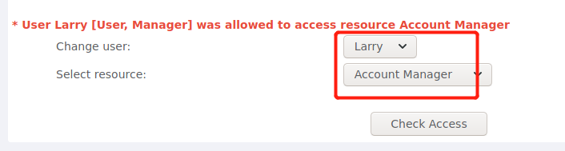
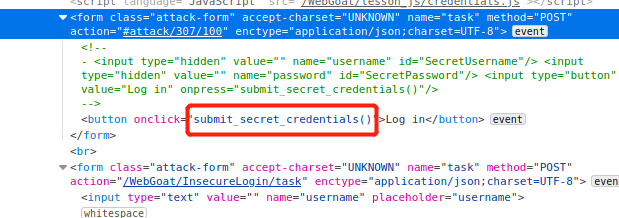

- [CHAP0x07 Web 应用漏洞攻防](#chap0x07-web-应用漏洞攻防)
  - [实验目的](#实验目的)
  - [实验环境](#实验环境)
  - [实验要求](#实验要求)
  - [实验准备](#实验准备)
    - [WebGoat 配置](#webgoat-配置)
  - [实验过程](#实验过程)
    - [WebGoat 7.1](#webgoat-71)
      - [General](#general)
        - [HTTP Basic](#http-basic)
      - [Access Control Flaws](#access-control-flaws)
        - [Using an Access Control Matrix](#using-an-access-control-matrix)
      - [Authentication Flaws](#authentication-flaws)
        - [Password Strength](#password-strength)
        - [Forgot Password](#forgot-password)
      - [Code Quality](#code-quality)
        - [Discover Clues in the HTML](#discover-clues-in-the-html)
      - [Concurrency](#concurrency)
        - [Thread Safety Problems](#thread-safety-problems)
        - [Shopping Cart Concurrency Flaw](#shopping-cart-concurrency-flaw)
      - [Injection Flaws](#injection-flaws)
        - [Command Injection](#command-injection)
        - [Numeric SQL Injection](#numeric-sql-injection)
        - [Log Spoofing](#log-spoofing)
        - [XPATH Injection](#xpath-injection)
        - [String SQL Injection](#string-sql-injection)
      - [Insecure Storage](#insecure-storage)
        - [Encoding Basics](#encoding-basics)
    - [WebGoat 8.0](#webgoat-80)
      - [General](#general-1)
        - [HTTP Basics](#http-basics)
      - [Authentication Flaws](#authentication-flaws-1)
        - [Secure Passwords](#secure-passwords)
      - [Cross-Site Scripting(XSS)](#cross-site-scriptingxss)
        - [Cross Site Scripting](#cross-site-scripting)
        - [Cross Site Scripting(stored)](#cross-site-scriptingstored)
      - [Insecure Communication](#insecure-communication)
        - [Insecure Login](#insecure-login)
    - [Juice Shop](#juice-shop)
      - [Broken Access Control](#broken-access-control)
        - [Admin Section](#admin-section)
        - [Five-Star Feedback](#five-star-feedback)
      - [Cryptographic Issues](#cryptographic-issues)
        - [Weird Crypto](#weird-crypto)
      - [Injection](#injection)
        - [Login Admin](#login-admin)
      - [Miscellaneous](#miscellaneous)
        - [Bully Chatbot](#bully-chatbot)
        - [Privacy Policy](#privacy-policy)
        - [Score Board](#score-board)
      - [Security Misconfiguration](#security-misconfiguration)
        - [Error Handing](#error-handing)
      - [Sensitive Data Exposure](#sensitive-data-exposure)
        - [Confidential Document](#confidential-document)
      - [XSS](#xss)
        - [Bonus Payload](#bonus-payload)
        - [DOM XSS](#dom-xss)
  - [问题及解决](#问题及解决)
  - [参考资料](#参考资料)
# CHAP0x07 Web 应用漏洞攻防
## 实验目的
- 了解常见 Web 漏洞训练平台；
- 了解常见 Web 漏洞的基本原理；
- 掌握 OWASP Top 10 及常见 Web 高危漏洞的漏洞检测、漏洞利用和漏洞修复方法；
## 实验环境
- WebGoat
- Juice Shop
## 实验要求
- [x] 每个实验环境完成不少于 5 种不同漏洞类型的漏洞利用练习；
- [x] （可选）使用不同于官方教程中的漏洞利用方法完成目标漏洞利用练习；
完成情况如下(有两个系统bug了好像，完成了但没有打勾)：


## 实验准备
### WebGoat 配置
- 根据`README.md`执行代码
    ```bash
    # 一次获取所有文件（包括所有子模块管理的文件）
    git clone https://github.com/c4pr1c3/ctf-games.git --recursive

    cd ctf-games

    # （可选）单独更新子模块
    git submodule init && git submodule update

    # 启动 webgoat 系列服务
    cd owasp/webgoat/ && sudo docker-compose up -d

    # 启动 juice-shop 及 shake-logger 服务
    cd ../../owasp/juice-shop/ && sudo docker-compose up -d
    ```
- 查看配置情况：状态为`healthy`，访问`127.0.0.1:8087/WebGoat/login`(WebGoat7.1)可以成功登录，访问`127.0.0.1:8088/WebGoat/login`(WebGoat8.0)可以成功登录，访问`127.0.0.1:3000`(Juice Shop)可以成功登录
  
  
## 实验过程
### WebGoat 7.1
#### General
##### HTTP Basic
- 输入框输入`webgoat`点击`GO!`,发现输入框里的内容反序变成`taogbew`
- 输入框内为`taogbew`,再次点击`GO!`，成功
  

#### Access Control Flaws
##### Using an Access Control Matrix
- 原理是不同的用户对数据拥有不同的权限，根据提示：
  >User Larry [User, Manager] did not have privilege to access resource Public Share Change user:	MoeLarryCurlyShemp
- 判断`Larry`具有`Account manager`权限，成功
  
  
#### Authentication Flaws
##### Password Strength
- 在所给网站测试破解密码的时间，输入就可以
  
  
- 但是我遇到的问题是，我测出来的和答案不一样，是不是算力提高了，答案没更新...？
  
  
##### Forgot Password
- 输入用户名到下一个问题，问最喜欢的颜色是什么

  
- 题目示例是`webgoat-red`，那就猜一下红配绿，成功
  
  
#### Code Quality
##### Discover Clues in the HTML
- 已经给了提示，网页源代码找线索，发现用户名密码，直接提交成功
  
  
#### Concurrency
##### Thread Safety Problems
- 多线程安全问题，两个页面，一个输入`dave`，另一个`jeff`，并尽量同时提交
  
  
- 发现两个页面的结果都是`dave`
  
  
##### Shopping Cart Concurrency Flaw
- 和上一题一样，并发问题，两页面提交不同的数据
  
  
- 左侧进入`purchase`，右侧`update`，左侧再`confirm`，成功
  
  
#### Injection Flaws
##### Command Injection
- 原理是在正常的参数提交过程中，添加恶意代码，代码被当成参数正常提交，但是在这个过程中被执行，从而实现攻击
- 发现了两种办法，但原理相同
  - 用`Webscarab`工具进行抓包，对`POST`包进行改写，添加`"& ps -ef"`
  
    
  - 再前端源代码中添加`"& ps -ef"`，然后再点击`view`提交

    
##### Numeric SQL Injection
- 查询语句是`SELECT * FROM weather_data WHERE station = [station]`,目的是通过更改`[station]`部分实现显示所有结果
- 使用`Webscarab`抓包然后对包进行修改，加入`or 1=1`
  
    
- 重新发包，成功显示所有结果

    
##### Log Spoofing
- 根据题目名字可知是从日志入手,题目提示下面的灰色框是日志信息，所以目的是再日志中显示`admin`身份登陆成功
- 在用户名中注入语句`%0d%0aLogin succeeded for username:admin`,成功
  
    
##### XPATH Injection
- `XPath` 即为 `XML` 路径语言，是一门在`XML`文档中查找信息的语言。`XPath` 基于 `XML` 的树状结构，有不同类型的节点，包括元素节点，属性节点和文本节点，提供在数据结构树中找寻节点的能力，可用来在 `XML` 文档中对元素和属性进行遍历。`XPath` 使用路径表达式来选取 `XML` 文档中的节点或者节点集。
- 在用户名处注入`' or 1=1 or 'a'='a`，成功
  
    
##### String SQL Injection
- 输入`Smith`观察`SQL`查询语句，找到注入方法`SELECT * FROM user_data WHERE last_name = '[input]'`，通过更改`[input]`实现注入，主要是最后的那个单引号要注释掉
- 查询框内输入`Smith ' or 1=1 --`，成功

    
#### Insecure Storage
##### Encoding Basics
- 讲了常见的编码基础,以及是否可以被解密
  
  
### WebGoat 8.0
#### General
##### HTTP Basics
- 根据问题找答案，问题是`POST`还是`GET`报文，`F12`查看报文，发现`POST`
  
  
- 寻找`magic_num`，报文参数里没有找到，前端代码搜索`magic_num`直接找到
  
  
- 输入报文类型和`magic_num`，任务完成
  
  
#### Authentication Flaws
##### Secure Passwords
- 密码强度的问题，尝试复杂密码直到满足要求即可
  
  
#### Cross-Site Scripting(XSS)
##### Cross Site Scripting
- `Stage2`:`cookie`一个域是一样的吗，你可以使用`JavaScript：alert(document.cookie);`，发现是一样的，回答`yes`
  
  
- `Stage7`:信用卡处输入`"<script>alert('my javascript here')</script>"`(注意带引号，否则不成功)
- `Stage10`:前端源代码寻找路径并输入
  
  
- `Stage11`:通过上一题的路径获得函数的正确路径并运行，通过`F12`获得代码的运行结果，输入输入框
  
  
- `Stage12`:答题就好，都对了就通过了
  
  
##### Cross Site Scripting(stored)
- 评论中给出了提示`calling webgoat.customjs.phoneHome()`
- 再评论框输入代码，`F12`查看运行结果，将其输入`submit`，任务完成
  
  
#### Insecure Communication
##### Insecure Login
- `F12`检查源代码，发现提交时用了一个函数`submit_secret_credentials()`
  
  
- 检查函数的源代码
  
  
- 在线解码十六进制代码
  
  

- 得到`usernamde:CaptainJack`和`password:BlackPearl`提交成功
### Juice Shop
#### Broken Access Control
##### Admin Section
- 进入商店的`administration`部分，查看网页源代码，根据`score-board`的思路，发现`path:administration`
  
  
- 访问`http://127.0.0.1:3000/#/administration`，登陆成功
  
  
##### Five-Star Feedback
- 删除顾客的五星评价，前提是已经登陆了`administration`账户
- 在`administration`页面成功删除
  
  
#### Cryptographic Issues
##### Weird Crypto
- 在页面内提交一个不安全的密码算法，猜想`md5`试一试
- 提交`md5`，成功
  
  
#### Injection
##### Login Admin
- 以`admin`身份登录账户，用户名采用万能句`' or 1=1 --`，密码任意
  
  
- `admin`管理员身份登陆成功
  
  
#### Miscellaneous
##### Bully Chatbot
- 采用暴力破解的办法，从`chatbot`处获得优惠券
- 和`chatbot`聊天，不断发送`coupon code`
  
  
##### Privacy Policy
- 这个很简单，不再附图，直接阅读隐私政策就完成了
##### Score Board
- 查看网页源代码，发现`path:score-board`
  
  
- 访问`http://127.0.0.1:3000/#/score-board`，任务完成
#### Security Misconfiguration
##### Error Handing
- 错误的登陆框：点击登陆，电子邮箱前加一个 ’ (单引号) 就行了
  
  
#### Sensitive Data Exposure
##### Confidential Document
- 访问路径`http://127.0.0.1:3000/ftp`
- 查看文件`acquisitions.md`，可以直接访问，没有权限保护
  
  
#### XSS
##### Bonus Payload
- 搜索框直接搜索所给代码`<iframe width="100%" height="166" scrolling="no" frameborder="no" allow="autoplay" src="https://w.soundcloud.com/player/?url=https%3A//api.soundcloud.com/tracks/771984076&color=%23ff5500&auto_play=true&hide_related=false&show_comments=true&show_user=true&show_reposts=false&show_teaser=true"></iframe>`
- 任务完成
  
  
##### DOM XSS
- 同样的漏洞，搜索框直接搜索代码
- 任务完成
  
  
## 问题及解决
1. `Command Injection`这个实验中，第一次没有成功
   - 原因：在`F12`中直接修改信息，并没有达到修改包的信息的作用
   - 解决：虽然改了请求信息，但是新旧包对比发现，`URL`根本没有改变；最后采用`webscarab`工具修改包的信息。

    
2. `Webscarab`和`Burpsuite`工具抓不到包(卡了好久...救命)
   - 原因：火狐浏览器没有配置代理
   - 解决：设置浏览器的端口为`8080`，设置浏览器代理配置

    

    
## 参考资料

[1] [WebGoat中文手册.pdf](https://max.book118.com/html/2017/1126/141622436.shtm)

[2] [kali linux Burp Suite极简使用教程](https://www.cnblogs.com/thechosenone95/p/10623462.html)

[3] [WebGoat8 M17 XSS 答案、题解](https://www.pianshen.com/article/1142906991/)

[4] [WebGoat系列实验Cross-Site Scripting (XSS)](https://www.cnblogs.com/yangmzh3/p/7542018.html)

[5] [WebGoat学习笔记（七）——Command Injection](https://blog.csdn.net/moonhedgehog/article/details/6031853)

[6] [WebGoat Command Injection sample](https://blog.csdn.net/kezhen/article/details/22977741)