# CHAP0x09 入侵检测
## 实验环境
- VirtualBox 6.1
- Kali Rolling 2109.2
## 实验要求
- [x] 实验一：配置snort为嗅探模式
- [x] 实验二：配置并启用snort内置规则
- [x] 实验三：自定义snort规则
- [x] 实验四：和防火墙联动
## 实验准备
### 配置网络环境
- 网络环境配置如图所示：
  >`Attacker-Kali`:`eth0:172.16.111.121/24`;`08:00:27:63:57:9b`
  >`Victim-Kali`:`eth0:127.16.111.122/24`;`08:00:27:e8:72:9d`
  >`Gateway-Debian`:`eth0:127.16.111.1/24`;`08:00:27:53:e0:03`

  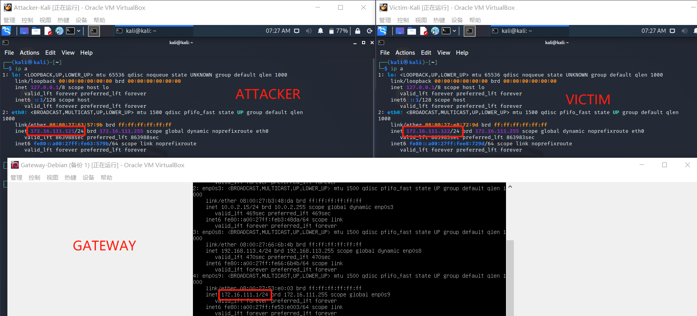
### 安装Snort
- 按照以下代码安装`Snort`
  ```shell
  # 禁止在apt安装时弹出交互式配置界面
  export DEBIAN_FRONTEND=noninteractive

  apt install snort
  ```

  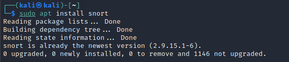
## 实验过程
### 实验一：配置snort为嗅探模式
- 按照如下代码进行配置：
  ```shell
  # 显示IP/TCP/UDP/ICMP头
  sudo snort –v

  # 显示应用层数据
  sudo snort -vd

  # 显示数据链路层报文头
  sudo snort -vde

  # -b 参数表示报文存储格式为 tcpdump 格式文件
  # -q 静默操作，不显示版本欢迎信息和初始化信息
  snort -q -v -b -i eth0 "port not 22"

  # 使用 CTRL-C 退出嗅探模式
  # 嗅探到的数据包会保存在 /var/log/snort/snort.log.<epoch timestamp>
  # 其中<epoch timestamp>为抓包开始时间的UNIX Epoch Time格式串
  # 可以通过命令 date -d @<epoch timestamp> 转换时间为人类可读格式
  # exampel: date -d @1511870195 转换时间为人类可读格式
  # 上述命令用tshark等价实现如下：
  tshark -i eth0 -f "port not 22" -w 1_tshark.pcap
  ```
- 显示`IP/TCP/UDP/ICMP`头
  
  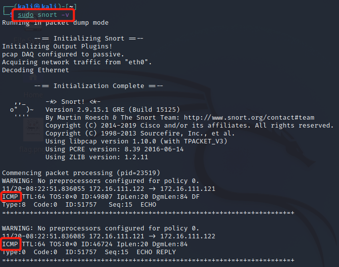
- 显示应用层数据
  
  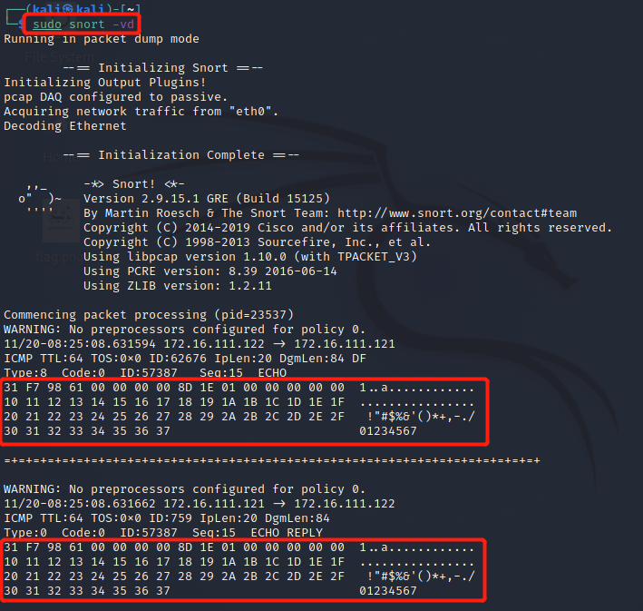
- 显示数据链路层报文头
  
  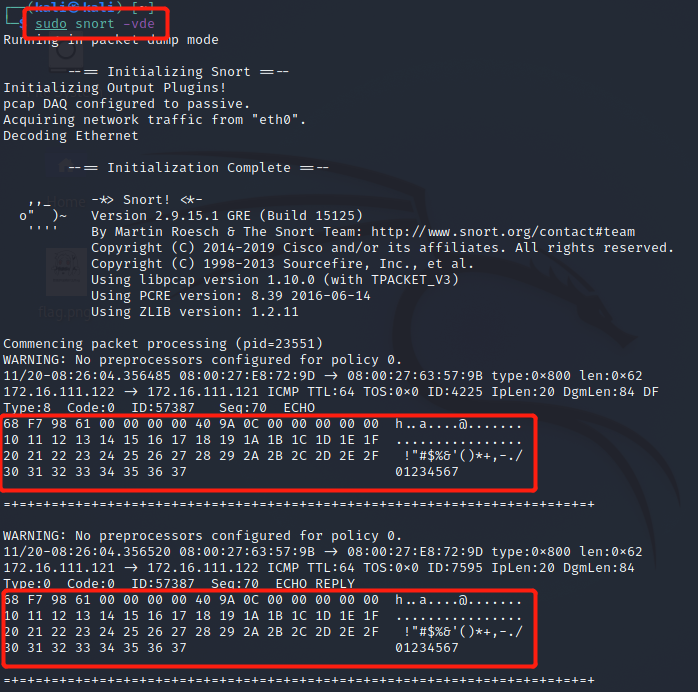
- 开始抓包
  
  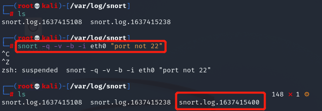
- 抓包完成，`cat`查看结果
  
  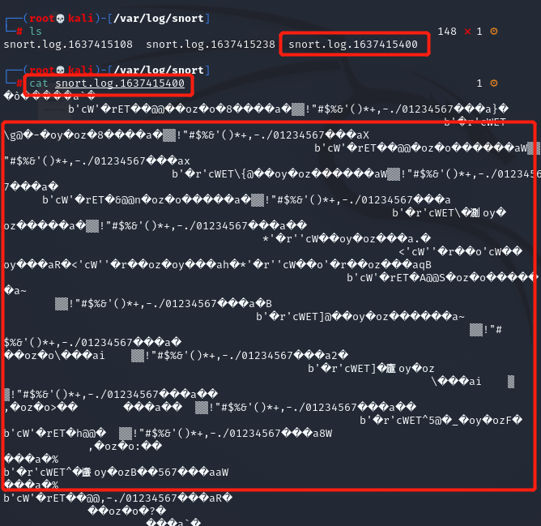
- 转换时间格式
  
  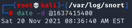
### 实验二：配置并启用snort内置规则
- 按照如下代码进行配置
  ```shell
  # /etc/snort/snort.conf 中的 HOME_NET 和 EXTERNAL_NET 需要正确定义
  # 例如，学习实验目的，可以将上述两个变量值均设置为 any
  snort -q -A console -b -i eth0 -c /etc/snort/snort.conf -l /var/log/snort/
  ```
- 找到`/etc/snort/snort.conf`对变量进行修改，`vim`编辑，`cat`查看
  
  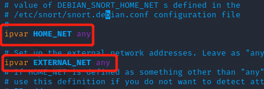
### 实验三：自定义snort规则
- 新建自定义`snort`规则文件
  ```shell
  # 新建自定义 snort 规则文件
  cat << EOF > /etc/snort/rules/cnss.rules
  alert tcp \$EXTERNAL_NET any -> \$HTTP_SERVERS 80 (msg:"Access Violation has been detected on /etc/passwd ";flags: A+; content:"/etc/passwd"; nocase;sid:1000001; rev:1;)
  alert tcp \$EXTERNAL_NET any -> \$HTTP_SERVERS 80 (msg:"Possible too many connections toward my http server"; threshold:type threshold, track by_src, count 100, seconds 2; classtype:attempted-dos; sid:1000002; rev:1;)
  EOF
  ```

  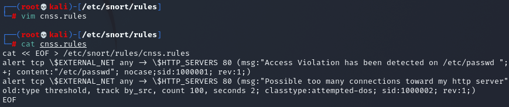
- 添加配置代码到 `/etc/snort/snort.conf`
  
  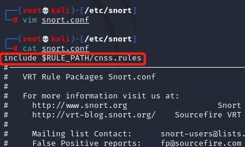
- 此时再次进行抓包，查看结果，发现文件变成了`alert`
  ```shell
  snort -q -A fast -b -i eth1 -c /etc/snort/snort.conf -l /var/log/snort/

  # 在attacker上使用ab命令进行压力测试
  ab -c 100 -n 10000 http://$dst_ip/hello
  ```

  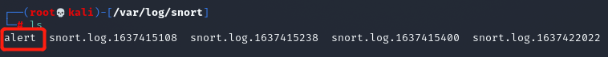
- 查看抓包结果
  
  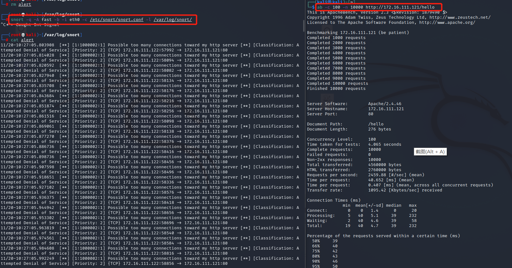
### 实验四：和防火墙联动
- 下载并解压缩脚本代码
  ```shell
  #获取脚本代码
  wget https://c4pr1c3.github.io/cuc-ns/chap0x09/attach/guardian.tar.gz
  # 解压缩 Guardian-1.7.tar.gz
  tar zxf guardian.tar.gz
  # 安装 Guardian 的依赖 lib
  apt install libperl4-corelibs-perl
  # 开启 snort
  snort -q -A fast -b -i eth0 -c /etc/snort/snort.conf -l /var/log/snort/
  ```
- 网络拓扑如下，并进行连通性测试：
  >**VM-1** IP: 172.16.111.122 eth0 内部网络 运行 nmap 扫描 VM-1
  >**VM-2** IP: 172.16.111.121 eth0 内部网络 运行 snort 和 guardian.pl

  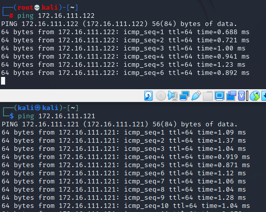
- 在`VM-2`上先后开启`snort`和`guardian.pl`
  ```shell
  # 开启 snort
  snort -q -A fast -b -i eth0 -c /etc/snort/snort.conf -l /var/log/snort/
  # 假设 guardian.tar.gz 解压缩后文件均在 /root/guardian 下
  cd /root/guardian
  ```
- 配置`guardian.conf`,并启动`perl guardian.pl -c guardian.conf`
  
  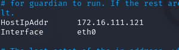
- 在`VM-1`用`nmap`暴力扫描`VM-2`：`nmap 172.16.111.121 -A -T4 -n -vv`

  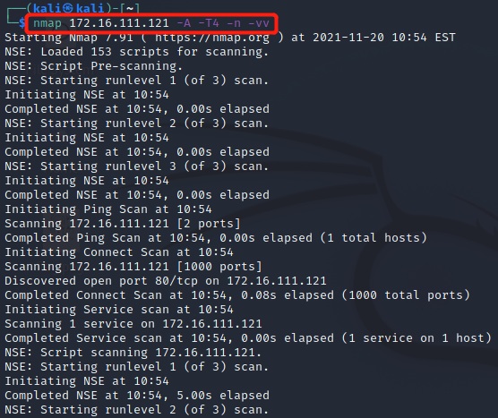
- 在`VM-2`上查看抓包情况，三种结果都可以看到暴力扫描和IP屏蔽的迹象
  
  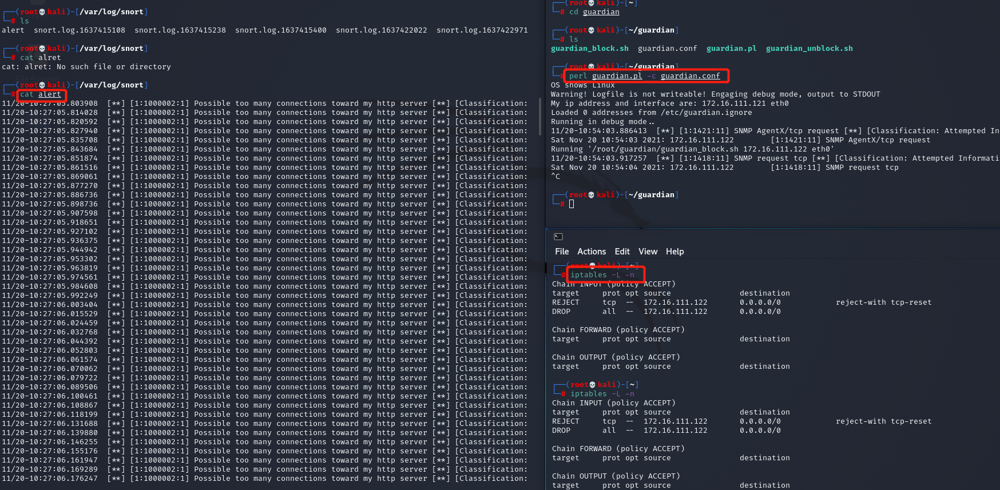
- 防火墙差别
  
  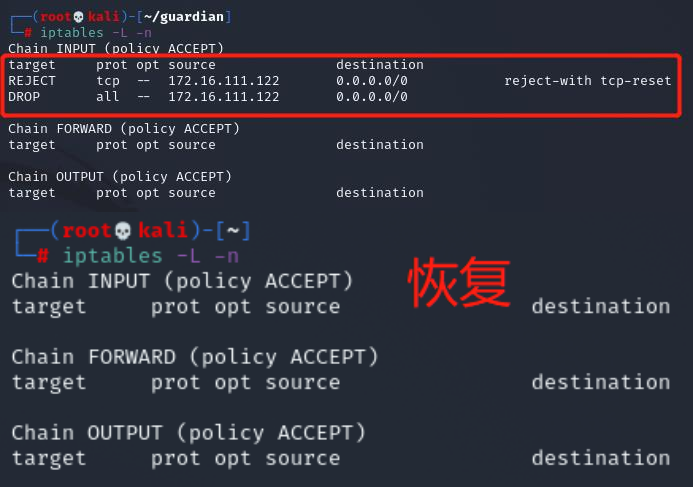
## 问题及解决
1. `IDS`与防火墙的联动防御方式相比IPS方式防御存在哪些缺陷？是否存在相比较而言的优势？
   >IDS/IPS概述
   >在现有网络中部署的系统有两类，分别为**检测系统（Intrusion Detection System，IDS）** 和 **防护系统（Intrusion Prevention System，IPS）**。顾名思义，检测是对行为的发现（告警）并不进行相应的处理；防护是对行为的发现进行相应的防御处理。
   - 缺陷：
     - 由于IDS本身只能检测出恶意行为，但不能根据行为进行阻断，而防火墙看似可以弥补这一缺陷，实际上IPS系统可以实施深层防御安全策略，即可以在应用层检测出攻击并予以阻断，这是防火墙所做不到的，当然也是入侵检测产品所做不到的。
   - 优势：
     - “IDS + 防火墙” 的联动防护机制，防火墙负责提供OSI第4层以下的基本安全环境和高速转发能力， 而IPS负责OSI第4层层流量的细粒度控制。
     - IDS偏向主动防御，通过嗅探等行为发现危险行为，并分析网络的安全情况。

2. 在`attacker`上使用`ab`命令进行压力测试
   - 更改自定义规则后发现没有抓到包，是因为用了`ping`来测试，没有符合自定义要求的包；解决方法是使用`ab`命令进行压力测试，选项更多，发送不同大小种类的包。
   - 网站性能压力测试是服务器网站性能调优过程中必不可缺少的一环。只有让服务器处在高压情况下，才能真正体现出软件、硬件等各种设置不当所暴露出的问题。
   - 性能测试工具目前最常见的有以下几种：ab、http_load、webbench、siege。ab是apache自带的压力测试工具。
## 参考资料
[1] [snort入侵检测技术](https://www.jianshu.com/p/cf104fd3510b)

[2] [师哥或师姐的实验报告](https://github.com/CUCCS/2020-ns-public-LyuLumos/tree/ch0x09/ch0x09)

[3] [「网络安全」安全设备篇（防火墙-IDS-IPS）](https://zhuanlan.zhihu.com/p/95664193)

[4] [ab命令压力测试](https://www.cnblogs.com/yueminghai/p/6412254.html)

[5] [Suricata用户指南](https://www.osgeo.cn/suricata/)