- [CHAP0x0B 常见蜜罐体验和探索](#chap0x0b-常见蜜罐体验和探索)
  - [实验目的](#实验目的)
  - [实验环境](#实验环境)
  - [实验要求](#实验要求)
  - [实验准备](#实验准备)
  - [实验过程](#实验过程)
    - [低交互蜜罐-`sshesame`](#低交互蜜罐-sshesame)
    - [中等交互蜜罐-`Cowrie SSH Honeypot`](#中等交互蜜罐-cowrie-ssh-honeypot)
    - [（可选）总结常见的蜜罐识别和检测方法](#可选总结常见的蜜罐识别和检测方法)
  - [问题及解决](#问题及解决)
  - [参考资料](#参考资料)
# CHAP0x0B 常见蜜罐体验和探索
## 实验目的
- 了解蜜罐的分类和基本原理
- 了解不同类型蜜罐的适用场合
- 掌握常见蜜罐的搭建和使用
## 实验环境
- Kali 2021.2
- [GitHub-cowrie/cowrie](https://github.com/cowrie/cowrie)
- [GitHub-jaksi/sshesame](https://github.com/jaksi/sshesame)
## 实验要求
- [x] 记录蜜罐的详细搭建过程；
- [x] 使用`nmap`扫描搭建好的蜜罐并分析扫描结果，同时分析「 `nmap` 扫描期间」蜜罐上记录得到的信息；
- [x] 如何辨别当前目标是一个「蜜罐」？以自己搭建的蜜罐为例进行说明；
- [x] （可选）总结常见的蜜罐识别和检测方法；
- [ ] （可选）基于`canarytokens`搭建蜜信实验环境进行自由探索型实验；
## 实验准备
- 网络拓扑结构如下：
  
  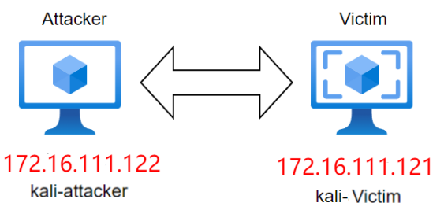
- 开始前先测一下连通性

  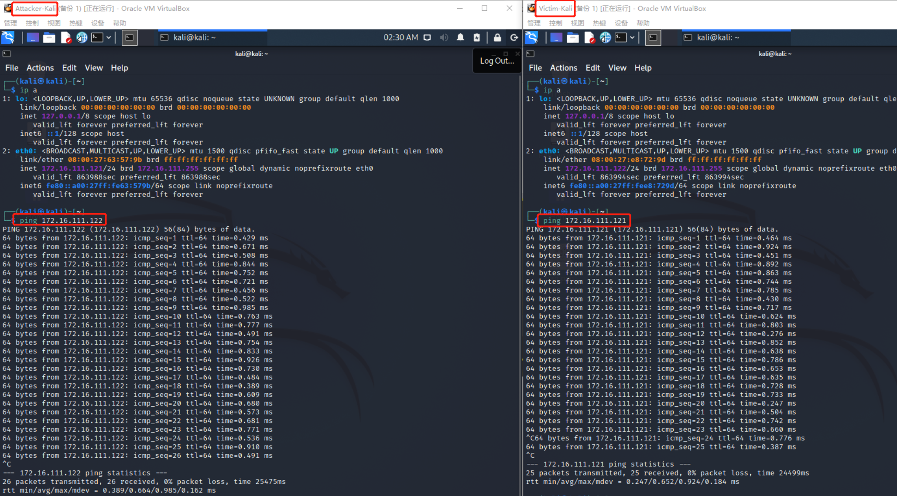
## 实验过程
### 低交互蜜罐-`sshesame`
- `sshesame`：一个假的`SSH`服务器,让每个人都进入并记录他们的活动日志。
>低交互蜜罐只会让攻击者非常有限地访问操作系统。“低交互”意味着，对手无法在任何深度上与您的诱饵系统进行交互，因为它是一个更加静态的环境。低交互蜜罐通常会模仿少量的互联网协议和网络服务，足以欺骗攻击者，而不是更多。通常，大多数企业都会模拟TCP和IP等协议，这使得攻击者可以认为他们正在连接到真实系统而不是蜜罐环境。
- 下载安装`sshesame`
  ```shell
  $ git clone https://github.com/jaksi/sshesame.git
  $ cd sshesame 
  $ go build
  ```
- 配置`docker`
  ```shell
  $ sudo docker run -it --rm\
    -p 127.0.0.1:2022:2022\
    -v sshesame-data:/data ghcr.io/jaksi/sshesame
  ```
- 启动`docker`并连接蜜罐`ssh -p 2022 127.0.0.1`

  >可以发现，每一条命令都被清晰地记录了，连输入的密码也记录了
  >由于是蜜罐，所以并不存在实际命令，出现`command not found`的报错

  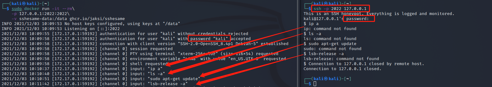
### 中等交互蜜罐-`Cowrie SSH Honeypot`
- `Cowrie`是一种中等交互的`SSH`和`Telnet`蜜罐，旨在记录暴力攻击和攻击者执行的`shell`交互。`Cowrie`还充当`SSH`和`telnet`代理，以观察攻击者对另一个系统的行为。同时也是一个模拟的 `SSH` 服务器。很多攻击者都是 `SSH` 登录，你可以把这个软件在22端口启动，真正的 `SSH` 服务器放在另一个端口。当别人以为攻入了服务器，其实进入的是一个虚拟系统，然后会把他们的行为全部记录下来。
  >中交互蜜罐是对真正的操作系统的各种行为的模拟，它提供了更多的交互信息，同时也可以从攻击者的行为中获得更多的信息。在这个模拟行为的系统中，蜜罐此时看起来和一个真正的操作系统没有区别，它们甚至是比真正系统还诱人的攻击目标。
- 下载安装`cowrie`
  ```shell
  # 克隆仓库
  git clone https://github.com/cowrie/docker-cowrie.git

  cd docker-cowrie/

  # 开启docker   
  docker pull cowrie/cowrie
  docker run -p 2222:2222 cowrie/cowrie
  ```
- `nmap`扫描发现开放的`2222`端口，并且过程被蜜罐记录
  
  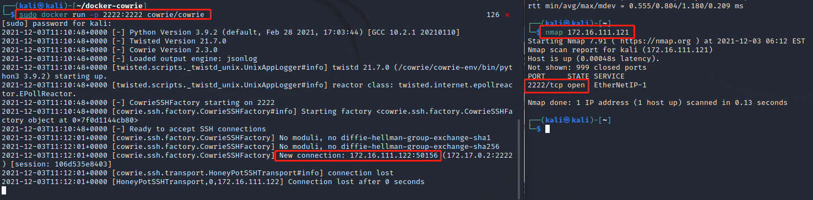
- `ssh`:以`root`身份连接蜜罐，注意端口号`ssh -p 2222 xxx`，因为只有这个端口是开放的
  >查看`docker`的情况，发现操作被清楚地记录，随意使用了一个密码登陆成功且密码被记录
  
  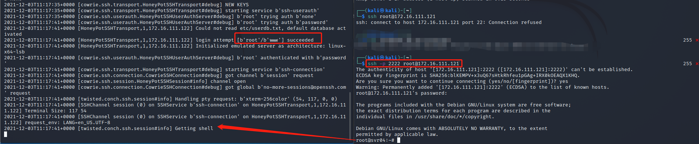
- 下面进行一下常用命令测试:
  - `lsb_release -a`:发现异常，显示命令不存在

    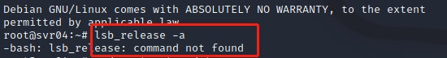
  - `sudo apt-get update`:发现异常，问题在于已经`sudo`且是`root`用户，显示权限不足

    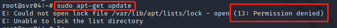
  - `ping xxx.com`:看起来是正常运行

    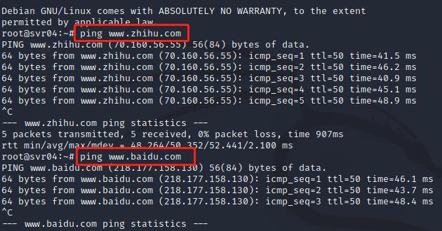
  - `cat & vim`:发现异常，`vim`显示命令不存在；`cat`问题在于有`a`这个文件，但显示文件不存在

    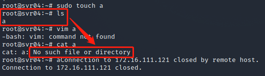
  - `echo $PATH`:发现异常，直接输出字符串而不是路径

    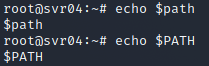
- 查看`docker`中的蜜罐日志
  ```shell
  # 将日志复制到本地查看
  docker cp a0f7c7db65ab:/cowrie/cowrie-git/var/log/cowrie /home/kali
  # jq带格式高亮查看 
  cat json.txt | jq '.'
  ```
- 将日志与命令相匹配，进行日志分析
  - `ssh`:可以看到，用户名和密码都被记录了

    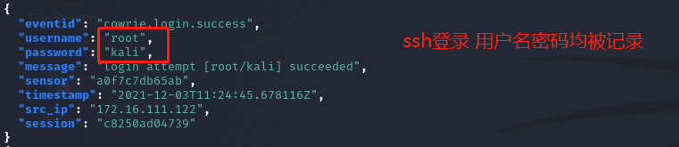
  - `ping`:正常，没有什么问题

    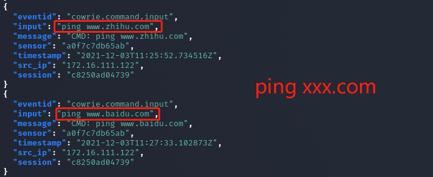
  - `lsb`:出现了`failed`，说明该命令没有在蜜罐里部署，找不到命令

    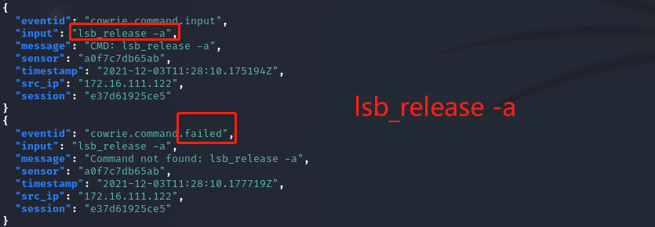
  - 其他命令:发现蜜罐中没有提前部署的命令会`failed`，其他虽然客户端出错了，但日志里没有显示
    
    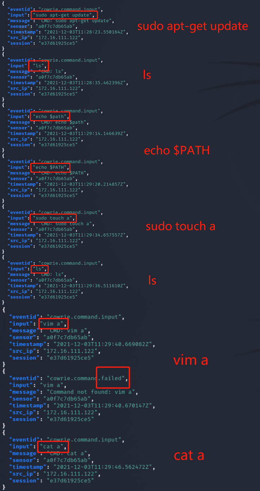
- 对于该蜜罐的分析
  - 登陆异常：在以`root`用户名登录时，随意输入密码即可成功登录
  - 退出异常：每隔一段时间，连接会自动断开（开始还以为是自己不小心终止的）
  - 命令异常：`echo $PATH`,`lsb_release -a`等等命令与正常运行结果不符（上面过程已分析）
### （可选）总结常见的蜜罐识别和检测方法
- 经验和直觉很重要
- 对低交互蜜罐的识别，主要集中在模拟技术的检测上
  - 通常存在着较为明显的特征
- 高交互蜜罐通常使用虚拟机进行部署，常用虚拟机探测技术进行识别
  - 虚拟机探测的目标：检查当前代码是否正运行在一台虚拟的主机上
  - 根据文件系统和注册表中的虚拟机信息探测
  - 根据虚拟主机的内存分配特征探测
  - 根据虚拟主机的硬件特征探测
  - 根据虚拟主机中的特殊指令与通道探测
- 高交互蜜罐通常采用内核级隐藏技术，主要有隐藏模块、隐藏文件、隐藏进程、隐藏连接等技术，可通过对隐藏技术的识别来进行判断
- 基于内核的 Sebek 组件用于捕获 SSH 和 SSL 加密的信息，常用于高交互蜜罐系统的数据捕获工具，可以对其进行检测。检测方法：
  - 查看反应时间
  - 观察网络传输计数器
  - 修改系统调用表
  - 查找隐藏模块
## 问题及解决
1. `kali`无法正常打开终端
   解决：`ctrl+alt+F1`进入命令行窗口，`reboot`重启
2. `go`命令报错
   原因：默认使用的是`proxy.golang.org`，在国内无法访问

   解决：执行命令：`go env -w GOPROXY=https://goproxy.cn`重新执行命令，可以正常执行
## 参考资料
[1] [GitHub-cowrie/cowrie](https://github.com/cowrie/cowrie)

[2] [GitHub-jaksi/sshesame](https://github.com/jaksi/sshesame)

[3] [师哥或师姐的实验报告](https://github.com/CUCCS/2018-NS-Public-jckling/blob/master/ns-0x11/0x11.md)

[4] [师哥或师姐的实验报告](https://github.com/CUCCS/2019-NS-Public-YanhuiJessica/tree/master/ns-0x11)

[5] [唐同学的实验报告 膜膜](https://github.com/CUCCS/2021-ns-public-Tbc-tang/blob/chap0x0b/0x0b.md)

[6] [linux命令下jq的用法简介](https://blog.csdn.net/qq_26502245/article/details/100191694)

[7] [kali linux 打不开终端的问题](https://blog.csdn.net/MyJDL/article/details/53130324)

[8] [go命令报错](https://blog.csdn.net/weixin_40412037/article/details/111225967)

[9] [知识 | 高交互蜜罐和低交互蜜罐有什么区别?](https://www.sohu.com/a/292203794_99909929)